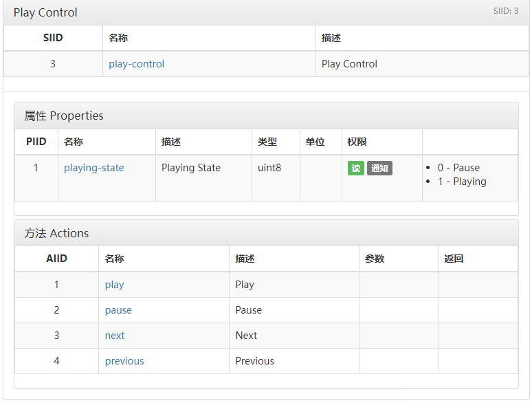
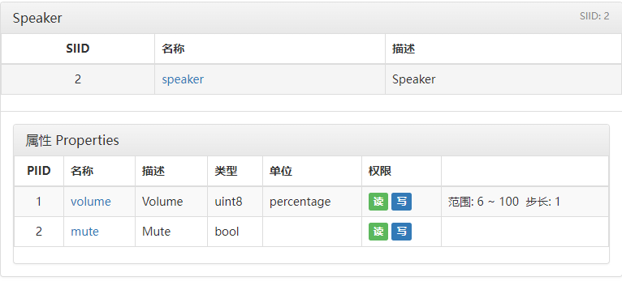

# SimpleMiHome
米家app的接口封装，可以用来控制小米的智能家居设备。本项目可作为HttpApi使用，也可以作为本地类库。

## 安装
```
git clone https://gitee.com/blokura/simple-mi-home
cd simple-mi-home
pip install -r requirements.txt
```


## 配置
在`config/config.ini`内配置小米账号，示例：
```
[account]
MiUsername = 小米账号
MiPassword = 小米账号的密码
MiNickname = 小伟
```
如需使用HttpApi，则配置http鉴权，示例：
```
[server]
AuthKey = 123456789
```

## 快速开始
### 本地使用
```python
from MiApi import MiService

mi = MiService()
speaker = mi.find_device("小爱音箱")    # 通过设备名初始化设备
# speaker.use_device("12345678")
# 小爱音箱播放文字
speaker.do_action(5, 1, ["声音测试"])
# 小爱音箱静默执行指令
speaker.do_action(5, 5, ["关闭空气净化器", False])
# 小爱音箱设置音量50%
speaker.set_device_prop(2, 1, 50)
# 小爱音箱获取当前音量
speaker.get_device_prop(2, 1)
```
### HttpApi使用
```python
# 服务端
from MiApi import http_server
http_server.run(host="0.0.0.0", port=8080)
```
```python
# 客户端
import requests

headers = {"Authorization": "123456789"}
data = {
    "sid": 1,
    "pid": 1,
    "device_id": "123456",
    "value": 50
}

# 设置device_id为123456的小爱音箱的音量为50%
requests.post("http://127.0.0.1:8080/set_prop", json=data, headers=headers)
```
## API说明
米家的智能家居遵循miot协议，指令查询地址：[https://home.miot-spec.com/](https://home.miot-spec.com/)  
每个操作对应siid，piid，方法（do action）则还有aiid。其中属性权限有读/写  
### 初始化设备
```python
from MiApi import MiService

mi = MiService
# speaker = mi.use_device("12345678") # 通过设备ID初始化
speaker = mi.find_device("小爱音箱")    # 通过设备名初始化设备
```  
如何获取设备ID？
```python
from MiApi import MiService
mi = MiService()
mi.get_device_list()
```

### 设置属性
  

以小爱音箱为例，播放控制的siid为3，为属性控制；播放状态的piid为1，权限为读，那么我们可以通过以下接口查询小爱音箱的播放状态：
```python
speaker.get_device_prop(3, 1)   # 3为siid 1为piid
```  
### 调用方法
通过以下接口调用方法（actions），让音箱暂停播放:
```python
speaker.do_action(3, 2) # 3为siid, 2为siid
```  
如果方法中带有参数怎么办？如让小爱同学播放语音，可以这样调用：
```python
speaker.do_action(5, 1, ["声音测试"]) # 参数统一归到一个list中
```
### 设置属性
以下为设置音量、静音的属性控制，其中音量属性的siid为2，piid为1，权限为读/写，设置音量为50%：  

  
  
```python
speaker.set_device_prop(2, 1, 50)
```   
## HttpApi接口  

所有的HTTP请求headers请带上 authorization=你配置的AuthKey  

```
# 获取设备属性
[POST] /api/get_prop
params:
    {
        "sid": 1,   // 设备的siid
        "pid": 1,   // 设备的piid
        "device_id": "12345678",    //设备的id
        "device_name": "小爱音箱"   // 可选参数 去掉device_list则该选项生效
    }

response: 
    {
        "code": 0,  // code不为0则错误
        "msg": "success",
        "data": {..., "value": 50, ...} //value为获取的值
    }
```
```
# 设置设备属性
[POST] /api/set_prop
params:
    {
        "sid": 1,   // 设备的siid
        "pid": 1,   // 设备的piid
        "value": 50, //属性值
        "device_id": "12345678",    //设备的id
        "device_name": "小爱音箱"   // 可选参数 去掉device_list则该选项生效
    }

response: 
    {
        "code": 0,  // code不为0则错误
        "msg": "success",
        "data": {......} 
    }
```  

```
# 调用方法（action）
[POST] /api/do_action
params:
    {
        "sid": 1,   // siid
        "aid": 1,   // aiid
        "params": ["test", 1], //属性值
        "device_id": "12345678",    //设备的id
        "device_name": "小爱音箱"   // 可选参数 去掉device_list则该选项生效
    }

response: 
    {
        "code": 0,  // code不为0则错误
        "msg": "success",
        "data": {......} 
    }
```  

```
# 获取设备列表
[GET] /api/get_device_list

response: 
    {
        "code": 0,  // code不为0则错误
        "msg": "success",
        "data": {......} 
    }
```
